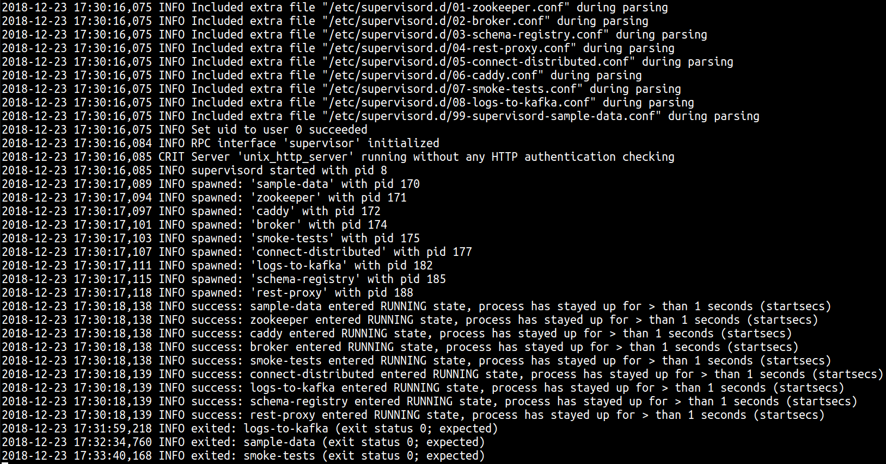
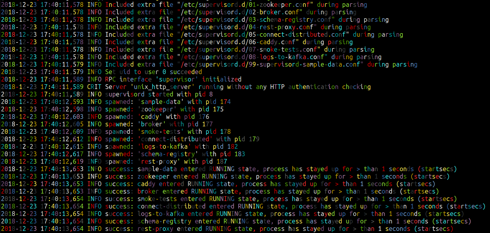

# rcol
This command line tool introduces bright and funky colors into your traditional boring logs.
Whenever you're scrolling logs and feeling like bad times, don't hesitate, add 

```blah blah | rcol ``` 

to your usual printing command and enjoy your logs like never before!

Something that used to look like this:



Will now look like this:


# How to use
1. Download the code
2. Compile the code with ```ghc --make rcol```
3. Add the rcol directory to PATH
4. Pipe that s*** with ``` | rcol```
